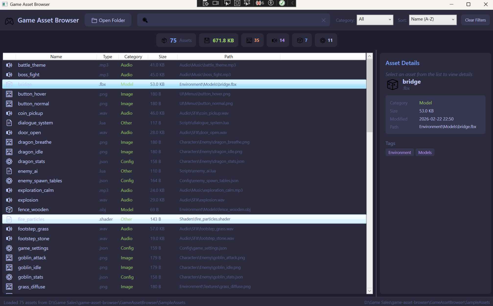
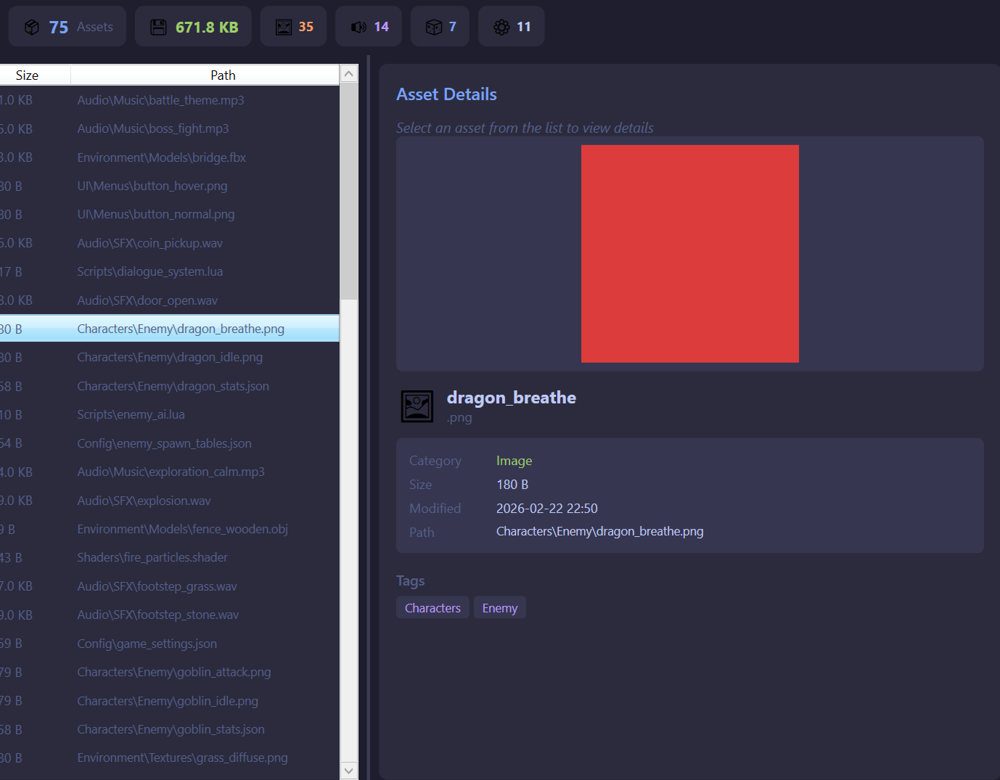
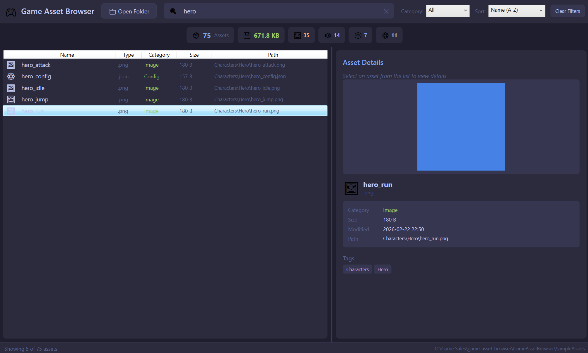

# GAME ASSET BROWSER

A WPF desktop application for browsing, searching, filtering, and previewing game assets that is built with clean **MVVM architecture**. Designed to demonstrate the kind of internal tooling that game studio tools teams build and maintain.



## PROJECT OVERVIEW

Game studios manage thousands of assets that includes textures, models, audio, configs, scripts, across complex folder structures. Tools programmers build internal applications to help artists, designers and developers navigate and work with these assets efficiently.

This project is a fully functional asset browser that:
- Recursively scans any directory for recognized game asset types
- Categorizes files automatically (Image, Audio, Model, Config, etc.)
- Generates tags from folder structure for intelligent filtering
- Provides real-time search, category filtering, and sorting
- Shows image previews and detailed metadata for selected assets
- Displays summary statistics (asset counts by type, total size)

## FEATURES

### Asset Discovery & Categorization
- Scans folders recursively for 30+ recognized file extensions
- Automatically categorizes assets: Images, Audio, 3D Models, Config/Data, Scripts
- Generates tags from directory hierarchy (e.g., `Characters/Hero/` -> tags: "Characters", "Hero")

### Search & Filtering
- **Real-time search** across file names, paths, extensions, and tags
- **Category filter** dropdown (All, Image, Audio, Model, Config, Other)
- **Sort options:** Name, Size, Date Modified, Category
- **Clear filters** button to reset all criteria
- Filters apply instantly as you type or change selections

### Preview & Details Panel
- **Image preview** for PNG, JPG, BMP, and GIF files
- Asset metadata: name, extension, category, file size, date modified, full path
- Auto-generated tag display with folder-based tags

### Statistics Dashboard
- Total asset count and combined file size
- Per-category counts (Images, Audio, Models, Config)
- Live updates as filters are applied



## Architecture — MVVM Pattern

This application follows the **Model-View-ViewModel** pattern, which is the standard architecture for WPF applications and a core requirement for tools programmer roles.

```
┌─────────────────────────────────────────────────┐
│                    VIEW (XAML)                  │
│  MainWindow.xaml                                │
│  - Defines all UI layout and styling            │
│  - Binds to ViewModel properties and commands   │
│  - ZERO code logic in code-behind               │
└──────────────────────┬──────────────────────────┘
                       │ Data Binding
┌──────────────────────┴──────────────────────────┐
│                  VIEWMODEL (C#)                 │
│  MainViewModel.cs                               │
│  - Holds all UI state (search text, filters)    │
│  - Exposes ICommand for button actions          │
│  - Contains filtering, sorting, search logic    │
│  - Notifies View of changes via INotifyPropChg  │
└──────────────────────┬──────────────────────────┘
                       │ Uses
┌──────────────────────┴──────────────────────────┐
│              MODEL + SERVICES (C#)              │
│  GameAsset.cs - Data model                      │
│  AssetScannerService.cs - File system scanning  │
│  RelayCommand.cs - ICommand implementation      │
│  BaseViewModel.cs - Property change notification│
└─────────────────────────────────────────────────┘
```

### Why MVVM Matters
- **Testability:** ViewModels can be unit tested without any UI
- **Separation of concerns:** UI designers can work on XAML while developers work on logic
- **Maintainability:** Changes to the UI don't require changes to business logic and vice versa
- **Data binding:** The View automatically stays in sync with the ViewModel

## TOOLS AND TECHNOLOGIES

- **C# / .NET 8.0** - application framework
- **WPF (Windows Presentation Foundation)** - desktop UI framework
- **XAML** - declarative UI markup language
- **MVVM Pattern** - architectural pattern with data binding
- **INotifyPropertyChanged** - property change notification for live UI updates
- **ICommand / RelayCommand** - command pattern for MVVM button binding
- **ObservableCollection** - collection that notifies the UI of changes

## PROJECT STRUCTURE

```
game-asset-browser/
├── GameAssetBrowser/
│   ├── Models/
│   │   └── GameAsset.cs              # Asset data model
│   ├── ViewModels/
│   │   ├── BaseViewModel.cs          # INotifyPropertyChanged base class
│   │   └── MainViewModel.cs          # Main application logic
│   ├── Views/
│   │   (MainWindow serves as primary view)
│   ├── Commands/
│   │   └── RelayCommand.cs           # Reusable ICommand implementation
│   ├── Services/
│   │   └── AssetScannerService.cs    # Directory scanning service
│   ├── SampleAssets/                 # Demo game assets (75 sample generated asset files through python scripting)
│   ├── MainWindow.xaml               # Main UI layout (View)
│   ├── MainWindow.xaml.cs            # Minimal code-behind
│   └── App.xaml                      # Application entry point
├── images/                           # Screenshots for README
└── README.md
```

## GETTING STARTED

### Prerequisites
- Windows 10/11
- Visual Studio 2022 with **.NET desktop development** workload
- .NET 8.0 SDK

### Build & Run
```bash
# Clone the repository
git clone https://github.com/rush2pranav/game-asset-browser.git

# Open GameAssetBrowser.sln in Visual Studio 2022
# Press F5 to build and run

# Click "Open Folder" and select the SampleAssets directory to demo
```

### Demo with Sample Assets
The repository includes a `SampleAssets/` folder with 80+ placeholder game files organized into a realistic game project structure (Characters, Environment, Audio, UI, Scripts, Config, Shaders). Open this folder in the app to see all features in action.



## WHAT I LEARNED

- **MVVM requires discipline but pays off.** The strict separation between View and ViewModel felt verbose at first, but it made debugging much easier and I always knew whether a bug was in the UI layer or the logic layer.
- **Data binding is the heart of WPF.** Understanding how `INotifyPropertyChanged`, `ObservableCollection`, and `{Binding}` work together is essential. Once it clicks, building reactive UIs becomes natural.
- **RelayCommand is a pattern, not a framework feature.** WPF doesn't ship with a built-in RelayCommand, you build your own. This is standard practice and understanding why it exists (to connect XAML buttons to ViewModel methods) is fundamental.
- **XAML styling is powerful but different.** Coming from other UI frameworks, XAML's resource system (Styles, Templates, StaticResource) takes getting used to but it enables very clean and consistent UI theming.

## POTENTIAL EXTENSIONS

- Add thumbnail caching for faster browsing of large asset libraries
- Implement drag and drop to import assets into the browser
- Add asset tagging UI (manual tag editing alongside auto-generated tags)
- Implement a tree view for folder navigation alongside the flat list
- Add file watching (FileSystemWatcher) to auto-refresh when assets change on disk
- Export filtered asset lists to CSV or JSON for pipeline integration
- Add unit tests for the ViewModel and Services layers

## LICENSE

This project is licensed under the MIT License — see the [LICENSE](LICENSE) file for details.

---

*Built as part of a Game Tools Programmer portfolio. This project demonstrates WPF, XAML, MVVM, and C#/.NET skills relevant to internal tools development at game studios. I am open to any and every feedback, please feel free to open an issue or connect with me on [LinkedIn](https://www.linkedin.com/in/phulpagarpranav/).*